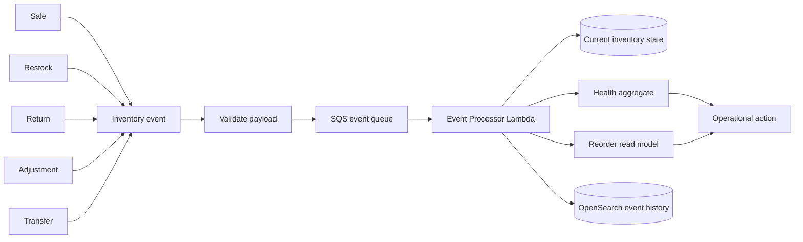
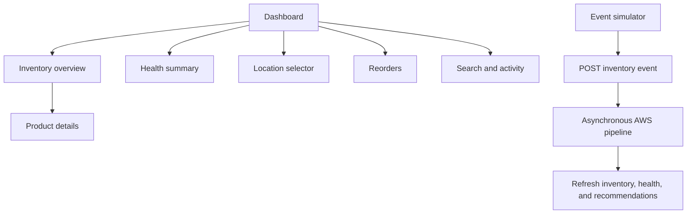
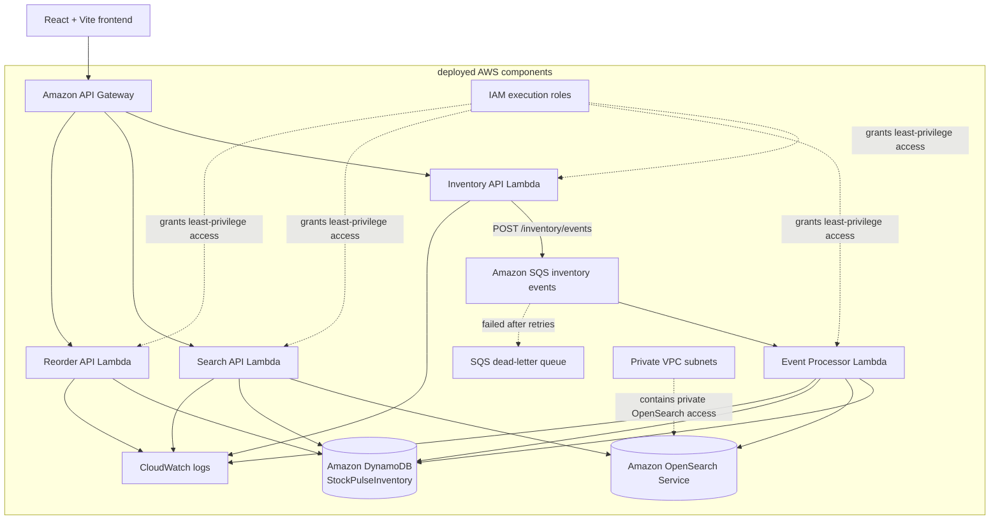
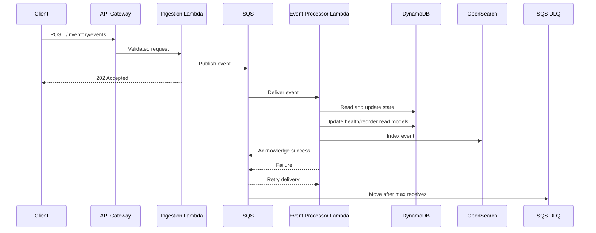
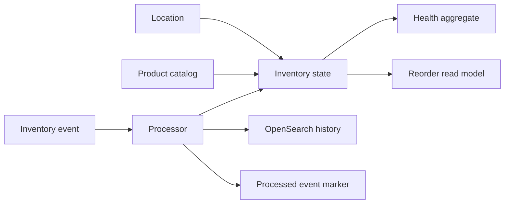
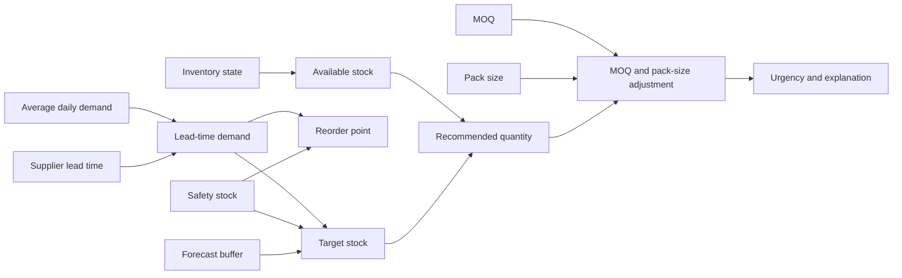

# Innvora — Intelligent Inventory Operations Platform

> **First Commit — Bharat Builds Tour 2026**
>
> Innvora is an AWS-native, event-driven inventory operations platform for independent store owners, warehouse operations leads, and multi-channel D2C teams. It turns inventory changes into a reliable event stream, maintains location-aware current stock, explains inventory health, and surfaces replenishment recommendations through a React dashboard backed by API Gateway, Lambda, DynamoDB, SQS, and Amazon OpenSearch.

[](https://aws.amazon.com/) [](https://www.typescriptlang.org/) [](https://react.dev/) [](LICENSE)

## Live deployment

| Resource | Link |
|---|---|
| Frontend | [innvora.vercel.app](https://innvora.vercel.app/) |
| API | [`1d1j9fcft5.execute-api.ap-south-1.amazonaws.com/prod`](https://1d1j9fcft5.execute-api.ap-south-1.amazonaws.com/prod) |
| AWS Region | `ap-south-1` |

## Technology stack

- **Frontend:** React 18, TypeScript, Vite, Tailwind CSS, Recharts, Lucide React
- **Backend:** Node.js 22 Lambda functions, TypeScript, Zod, AWS SDK v3
- **State:** Amazon DynamoDB single-table design with partition-bounded access patterns
- **Events:** Amazon SQS with retry handling and a dead-letter queue
- **History:** Amazon OpenSearch Service for searchable inventory events
- **Infrastructure:** AWS CDK, VPC networking, IAM roles, CloudWatch logging
- **Testing:** Vitest for domain, repository, service, handler, and integration-readiness tests

## The Problem

A traditional inventory screen answers only one question: **how many units are there right now?** Operations teams need a much richer answer:

- What do I have at each location?
- What changed, and when?
- Which stock is reserved versus available?
- What is running low?
- Where is the risk concentrated?
- What should I reorder, in what quantity, and why?

Inventory is therefore not just a number. It is the current projection of a stream of sales, restocks, returns, adjustments, and transfers. Innvora separates the current operational state from the history that produced it, then builds health and replenishment read models on top of that state.

<p align="center">
  
</p>

## What Innvora Does

An inventory event enters through the API, is validated at the boundary, and is accepted asynchronously. The processor consumes it from SQS, updates the location/product state in DynamoDB, updates health and reorder read models, and indexes the event in OpenSearch for later discovery.

Supported event types are `SALE`, `RESTOCK`, `RETURN`, `ADJUSTMENT`, `TRANSFER_IN`, and `TRANSFER_OUT`.



The flow is deliberately asynchronous:

1. The client submits an event to `POST /inventory/events`.
2. The ingestion handler validates the payload and publishes it to SQS.
3. The API returns `202 Accepted` without waiting for downstream mutation.
4. The processor validates the queued event and reads the current state.
5. DynamoDB is updated with the new quantity and available quantity.
6. Health aggregates and replenishment recommendations are refreshed.
7. The event is indexed in OpenSearch and the message is acknowledged.
8. Failed messages are retried by SQS and eventually moved to the DLQ.

## Who It's For

| User | What they need |
|---|---|
| **Independent store owners** | A clear view of what is available, which products need attention, and what to order next without reading raw logs. |
| **Warehouse operations leads** | Location-bounded stock visibility, health distribution, reserved-versus-available quantities, and a searchable event history. |
| **Multi-channel D2C businesses** | A common operational view across fulfillment hubs, with event ingestion that can absorb bursts from sales and restocking workflows. |

## Product Walkthrough

The dashboard is designed around action rather than data collection. With the seeded dataset, it provides 12 products across 3 fulfillment hubs and displays the resulting inventory states and health distribution.

### Dashboard and inventory

- Inventory overview with available and reserved stock
- Health summary for `HEALTHY`, `REORDER_SOON`, `CRITICAL`, and `OVERSTOCKED` items
- Location selector for regional warehouse views
- Reorder points, safety stock, and last-updated information
- Fulfillment/location status and action-oriented attention lists
- Product catalog and product details
- Product onboarding with validation, duplicate SKU rejection, supplier data, location association, and optional initial stock

### Operations and history

- Replenishment recommendations with demand, lead time, order quantity, urgency, and explanation
- Event history search backed by OpenSearch
- Filters for SKU, product, location, event type, and date range
- Paginated results
- Event simulator for demonstrating `SALE`, `RESTOCK`, `RETURN`, `TRANSFER_IN`, `TRANSFER_OUT`, and `ADJUSTMENT`



## Architecture



The CDK stack defines four Node.js 22 ARM64 Lambda functions, a regional API Gateway, an on-demand DynamoDB table, an encrypted SQS queue and DLQ, and a single-node encrypted OpenSearch 2.11 domain in private VPC subnets. The backend adapters compose the domain services rather than duplicating business logic inside infrastructure code.

## AWS Services

| AWS Service | How Innvora uses it | Why it matters |
|---|---|---|
| **Amazon API Gateway** | Exposes the inventory, search, reorder, catalog, and event-ingestion routes with CORS support. | Provides one HTTPS API boundary for the dashboard and external event producers. |
| **AWS Lambda** | Runs inventory APIs, event ingestion, event processing, search, and reorder logic. | Keeps compute independently deployable and scales the request and processing paths separately. |
| **Amazon DynamoDB** | Stores current inventory, catalog entities, health aggregates, reorder read models, and processed-event markers. | Provides the operational state store around the access patterns the dashboard actually needs. |
| **Amazon SQS** | Buffers accepted inventory events before the processor consumes them. | Decouples request latency from mutation work and provides retryable delivery. |
| **Amazon SQS DLQ** | Receives messages that continue to fail after the configured receive attempts. | Preserves failed work for diagnosis instead of silently losing it. |
| **Amazon OpenSearch Service** | Indexes processed inventory events and serves full-text, filtered, date-range, and paginated history searches. | Separates event discovery from key-value operational reads. |
| **Amazon VPC** | Places OpenSearch in private subnets and restricts Lambda-to-domain connectivity with security groups. | Keeps the search domain private while allowing the backend to reach it. |
| **IAM** | Supplies Lambda execution roles and permissions for DynamoDB, SQS, OpenSearch, and logging. | Avoids static application credentials and keeps permissions scoped to workloads. |
| **Amazon CloudWatch** | Receives explicit Lambda log groups and structured application logs. | Makes event processing, validation, and infrastructure failures observable. |

## Why Event-Driven Inventory?

The API should not have to wait for a complete state mutation, aggregate update, and search-index write before acknowledging a sale or restock. SQS gives Innvora an explicit boundary between ingestion and processing.



This implements asynchronous processing, buffering, retry behavior, failure isolation, and DLQ handling. Event IDs are checked in the processed-event store before mutation, so a redelivered event is ignored rather than applying its quantity change twice. The design also leaves room for additional consumers without making the API responsible for every downstream action.

## DynamoDB Data Model

The deployed table is `StockPulseInventory`, configured for `PAY_PER_REQUEST` billing with point-in-time recovery. The application uses a single-table layout with `PK` and `SK`; `GSI1PK`/`GSI1SK` support SKU and urgency-oriented lookups.

| Entity | PK | SK | GSI1 | Purpose |
|---|---|---|---|---|
| Inventory state | `LOCATION#<locationId>` | `PRODUCT#<productId>` | `SKU#<sku>` / location | Current quantity, reserved quantity, available quantity, thresholds, and timestamp. |
| Product catalog | `CATALOG#PRODUCT` | `PRODUCT#<productId>` | `SKU#<sku>` / metadata | Product and supplier-facing catalog data. |
| Supplier | `CATALOG#SUPPLIER` | `SUPPLIER#<supplierId>` | — | Supplier name, lead time, and reliability data. |
| Location | `CATALOG#LOCATION` | `LOCATION#<locationId>` | — | Fulfillment hub metadata. |
| Health aggregate | `AGGREGATE#HEALTH` | `GLOBAL` or `LOCATION#<locationId>` | — | Precomputed health counts. |
| Reorder read model | `REORDER#<locationId>` | `PRODUCT#<productId>` | `URGENCY#<level>` / days remaining | Precomputed recommendations and reasons. |
| Idempotency marker | `EVENT#<eventId>` | `PROCESSED` | — | Records that an event has already been applied. |



The main operational queries are bounded by a location partition or a known key. Normal reads use `Query`/`Get` access patterns rather than an unrestricted table scan. `availableQuantity` is represented as quantity less reserved quantity, with the processor preserving the state needed by the dashboard.

## Designing for Scale

The repository implements several scale-oriented decisions without making benchmark claims:

- Inventory reads can be bounded to a location partition; location queries can be issued independently for a global view.
- Health counts are maintained as precomputed aggregate items, so the health endpoint can use a key lookup when the aggregate exists.
- Reorder recommendations are persisted as a read model and served without recalculating every recommendation for each dashboard request.
- `PAY_PER_REQUEST` DynamoDB billing matches the variable traffic profile of a hackathon deployment.
- SQS absorbs event bursts and lets Lambda process asynchronously.
- OpenSearch handles historical event search while DynamoDB remains the source for current operational state.
- Pagination and explicit limits are applied at API boundaries and in OpenSearch searches.

## Explainable Replenishment Engine

The reorder engine is pure TypeScript domain logic. It combines current stock, demand, supplier lead time, safety stock, MOQ, pack size, and a forecast buffer into a recommendation that includes a human-readable reason.

```text
available stock     = current stock - reserved stock
lead-time demand    = average daily demand × supplier lead time
reorder point       = lead-time demand + safety stock
target stock        = lead-time demand + safety stock + forecast buffer
recommended qty     = max(0, target stock - available stock)
```

The recommended quantity is adjusted to respect the supplier's minimum order quantity and pack size. Days of stock remaining are also exposed where demand is available. The implementation handles zero demand safely and returns an explanation rather than an opaque number.



Health and urgency values are `CRITICAL`, `REORDER_SOON`, `HEALTHY`, and `OVERSTOCKED`. The processor derives these from available stock, safety stock, and reorder-point rules; recommendations include the underlying demand, lead time, quantity, and reason so an operator can review the decision.

## Historical Event Search

DynamoDB answers **what is true now**. OpenSearch answers **what happened**. The processor indexes event fields including `eventId`, `productId`, `sku`, `locationId`, `eventType`, quantity changes, timestamps, and source.

`GET /inventory/search` supports:

- `q` — fuzzy multi-field search over SKU, product, location, event type, and source
- `sku`
- `productId`
- `locationId`
- `eventType`
- `startDate`
- `endDate`
- `page`
- `limit`

The repository builds term filters and timestamp ranges, sorts by timestamp descending, and returns results with pagination metadata. Empty searches are rejected at the API boundary unless a filter is supplied.

## Product Catalog

The product workflow supports:

- Product creation through `POST /products`
- Runtime validation with Zod
- SKU uniqueness checks with a conflict response for duplicates
- Product and supplier information
- Reorder point, safety stock, MOQ, and pack size
- Location association through `locationId`
- Optional positive `initialStock` to create baseline inventory

The catalog also exposes locations, suppliers, products, and product details for the dashboard and onboarding flow.

## Reliability & Security

Implemented reliability and security measures include:

- Zod validation for product, inventory, event, pagination, date, and search inputs
- SQS visibility timeout and configured receive attempts with a DLQ
- Event-ID-based duplicate detection before applying a mutation
- Structured JSON logging from backend services
- CloudWatch log groups for Lambda functions
- IAM execution roles generated by CDK rather than static AWS keys in application code
- Private VPC placement and security-group restrictions for OpenSearch
- HTTPS/SigV4-authenticated OpenSearch requests
- Encrypted SQS and OpenSearch resources where configured
- DynamoDB point-in-time recovery
- Consistent API error responses and explicit handling for invalid input, missing records, and infrastructure failures

This is a hackathon deployment, not a claim of certification or enterprise compliance.

## API

Base URL: `https://1d1j9fcft5.execute-api.ap-south-1.amazonaws.com/prod`

| Method | Endpoint | Purpose |
|---|---|---|
| `GET` | `/inventory` | Paginated inventory list with optional `locationId`, `status`, `page`, and `limit`. |
| `POST` | `/inventory/events` | Validate and enqueue an inventory event; returns `202 Accepted`. |
| `GET` | `/inventory/health` | Return aggregate health counts, optionally for a location. |
| `GET` | `/inventory/search` | Search OpenSearch event history with text, entity, event-type, date, and pagination filters. |
| `GET` | `/inventory/{productId}` | Return inventory state for a product, optionally narrowed by location. |
| `GET` | `/inventory/location/{locationId}` | Return inventory for one fulfillment location. |
| `GET` | `/reorders` | Return recommendations and summary, with optional location, urgency, page, and limit filters. |
| `GET` | `/products` | List products. |
| `POST` | `/products` | Create a product and optionally initialize stock. |
| `GET` | `/products/{productId}` | Retrieve product details. |
| `GET` | `/locations` | List active fulfillment locations. |
| `GET` | `/suppliers` | List suppliers. |
| `GET` | `/notifications` | Return operational alerts based on urgent precomputed recommendations. |

See [`docs/api-demo.md`](docs/api-demo.md) for curl examples and the asynchronous event response.

## Testing

Backend tests run with Vitest:

```bash
cd backend
npm install
npm test
```

The test suite covers:

- Domain and runtime validation
- Inventory repository behavior and availability calculations
- Inventory service filtering, pagination, and health behavior
- Reorder formulas, urgency, MOQ/pack-size handling, and zero-demand safety
- Event ingestion validation and `202` responses
- SQS publishing failure handling
- Event processor updates for sale, restock, return, transfer, and duplicate events
- OpenSearch indexing, filtering, and pagination behavior
- HTTP and environment helpers
- Integration-readiness scenarios connecting state mutation, idempotency, health, and reorder behavior

Frontend verification:

```bash
cd frontend
npm run typecheck
npm run lint
npm run build
```

## Deployment

The AWS infrastructure is defined in `infrastructure/` with AWS CDK and targets `ap-south-1`.

```bash
cd infrastructure
npm install
npm run build
npm run synth
npm run diff
npm run deploy
```

Deployment provisions the VPC and private OpenSearch domain, Lambda functions, API Gateway routes, DynamoDB, SQS and DLQ, IAM roles, and CloudWatch log groups. Deployment and destruction are explicit commands; they are not run automatically. Local development uses the AWS credential chain, while deployed Lambdas use IAM roles. Never commit credentials, tokens, or `.env` values.

## Repository Structure

```text
Innvora/
├── backend/
│   ├── src/
│   │   ├── domain/
│   │   ├── handlers/
│   │   ├── repositories/
│   │   ├── services/
│   │   └── validation/
│   ├── tests/
│   └── package.json
├── frontend/
│   ├── src/
│   │   ├── api/
│   │   ├── components/
│   │   ├── hooks/
│   │   └── types/
│   └── package.json
├── infrastructure/
│   ├── bin/
│   ├── lib/
│   ├── test/
│   └── package.json
├── docs/
│   ├── api-demo.md
│   ├── demo-data.md
│   └── demo-flow.md
├── sample-data/
├── scripts/
├── implementation-plan.md
├── package.json
└── README.md
```

## Development Journey

The repository history shows an incremental build rather than a frontend-only prototype. The implementation evolved through the project foundation, domain models and validation, DynamoDB repositories, event ingestion, the SQS processor, health and reorder read models, OpenSearch search, API integration, frontend integration, infrastructure work, and deployment polish. Multiple repository contributors are represented in the Git history; the README intentionally describes the engineering stages without assigning unverified line-level ownership.

## What We Learned

- DynamoDB design starts with access patterns: location/product keys and read models are more useful than a relational schema translated directly into a table.
- Asynchronous processing makes the API responsive while giving downstream mutation and indexing their own failure boundaries.
- Idempotency must be explicit because queue delivery can repeat; event IDs are part of the processing contract.
- DynamoDB and OpenSearch have different jobs: one serves current state and keyed aggregates, the other serves historical discovery.
- CDK dependency ordering, VPC networking, OpenSearch policies, and SigV4/TLS setup are application concerns in a serverless architecture—not just deployment details.
- Precomputing health and reorder views makes the dashboard read path simpler and easier to reason about.
- Typed API contracts and a local/mock frontend path make it possible to connect a polished UI to a cloud backend without duplicating domain rules.

## AWS Experience & Feedback

Building Innvora with AWS made the architectural trade-offs tangible. Lambda and API Gateway made the API and processor boundaries straightforward; DynamoDB encouraged us to design around location and product access patterns; SQS provided a practical buffer between accepting and applying changes; and CloudWatch gave the processing path a structured operational trail.

The most hands-on complexity came from the boundaries between services: granting the right IAM permissions, ordering CDK resources and dependencies, allowing private Lambda-to-OpenSearch traffic through VPC controls, and signing OpenSearch requests with SigV4 over TLS. Those constraints were valuable feedback: a cloud architecture is not complete when the code compiles—it is complete when identity, networking, retry behavior, and observability agree with the application flow.

## Team Contributions

The repository history verifies these contributors, but it does not provide a reliable role-by-role attribution for every change. The table therefore recognizes the team without inventing responsibilities.

| Team member | Repository-grounded contribution record |
|---|---|
| **Shreya Jha** (`ShreyaJ-27`) | Led backend architecture and implementation for Innvora, including the domain model, validation, DynamoDB repository layer, SQS-based inventory event ingestion, asynchronous event processing, OpenSearch integration, inventory/search APIs, replenishment engine, and AWS infrastructure using CDK. Managed AWS deployment and debugging across API Gateway, Lambda, SQS, DynamoDB, OpenSearch, VPC, IAM, and CloudWatch, including resolving deployment and infrastructure configuration issues. Also led the final product polish, integration, technical validation, and deployment readiness. |
| **Soumya Kumari** (`soumyakumari0205-svg`) | Contributed to implementation planning and product architecture, helping define how Innvora should work as an operational inventory platform and how the product should solve real-world inventory problems. Worked on frontend-backend integration and helped connect the product experience with the deployed backend capabilities, ensuring the application workflow aligned with the underlying inventory and event-processing architecture. |
| **Snigdha Lohith** (`aoiyuki0`) | Worked on the frontend implementation of Innvora, including the operational dashboard and user-facing inventory experience. Contributed to the interface components and frontend workflows that present inventory health, fulfillment locations, replenishment information, activity, and other operational data to users. |

## AI & Development Tools

The repository does not document a specific AI coding tool or a verifiable AI-assisted workflow. No tool is claimed here. The project does document its engineering toolchain: TypeScript, Vite, React, AWS CDK, AWS SDK v3, Zod, ESLint, Vitest, and the AWS CLI credential chain.

## Future Directions

These are intentionally future work, not current claims:

- Supplier integrations and automated purchase-order creation
- ERP, POS, marketplace, and warehouse-system connectors
- Richer demand forecasting and seasonality-aware buffers
- Multi-tenant access control, authentication, and role-based workflows
- Inter-location transfer recommendations and execution
- Mobile warehouse workflows and barcode-assisted operations
- More extensive alerting, operational dashboards, and deployment monitoring

## Hackathon Submission

Innvora is our submission for **First Commit — Bharat Builds Tour 2026**: a practical AWS-based demonstration of how current inventory state, historical events, and explainable replenishment can work together in an operational product.

Useful guides:

- [`docs/demo-flow.md`](docs/demo-flow.md)
- [`docs/demo-data.md`](docs/demo-data.md)
- [`docs/api-demo.md`](docs/api-demo.md)

## License & Third Party

Innvora is released under the [MIT License](LICENSE), copyright © 2026 Shreya Jha. JavaScript and TypeScript dependencies are managed through the package manifests and lockfile in this repository; consult those manifests for their individual licenses and notices.
