# StockPulse — Implementation Plan

## 1. Project Overview

**StockPulse** is a visual, no-code inventory health and smart reordering platform for:

- Independent store owners
- Warehouse operations leads
- Multi-channel D2C brands
- Retail and distribution teams

The system centralizes current inventory state, historical inventory events, regional demand signals, and supplier transit information into a single operational dashboard.

The core product promise is:

> **Know what is in stock, understand what changed, and know what to reorder next — without digging through massive inventory logs.**

StockPulse is designed as an AWS-native, event-driven system with:

- **DynamoDB** for low-latency current inventory state
- **SQS** for resilient inventory-event buffering
- **Lambda** for serverless event processing and APIs
- **OpenSearch** for fast historical inventory search
- **API Gateway** for backend API exposure
- **AWS CDK** for reproducible infrastructure
- **CloudFront + S3** for frontend delivery
- **React + TypeScript** for the visual dashboard

The implementation is intentionally **backend-first**. The frontend is built only after the backend contracts, APIs, data flows, and smart-reorder engine are stable.

---

# 2. Product Goals

## Primary Goals

1. Maintain a reliable current inventory state across multiple locations.
2. Process inventory changes asynchronously and reliably.
3. Preserve historical inventory events for search and analysis.
4. Provide fast search across large volumes of inventory history.
5. Calculate inventory health automatically.
6. Generate explainable smart reorder recommendations.
7. Give non-technical users a visual operational dashboard.
8. Demonstrate meaningful use of AWS services rather than adding services without purpose.
9. Keep the architecture modular enough to scale beyond the hackathon MVP.

## Secondary Goals

- Support regional inventory visibility.
- Surface supplier lead-time impact.
- Detect critical and near-reorder inventory.
- Make inventory recommendations explainable.
- Provide a foundation for future demand forecasting.

---

# 3. Non-Goals for the Initial MVP

The first implementation will **not** attempt to build:

- Full ERP functionality
- Full warehouse management functionality
- Purchase-order execution
- Payment processing
- Complex user-management/RBAC
- Advanced ML forecasting
- Multi-cloud deployment
- Fully autonomous procurement

These can be added after the core inventory intelligence platform is stable.

---

# 4. High-Level System Architecture

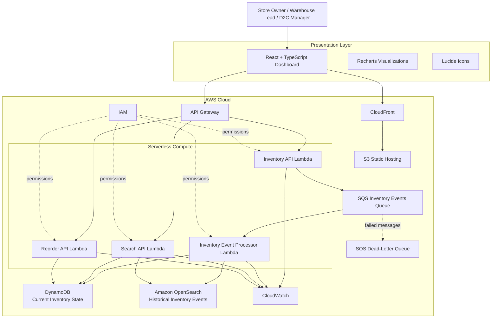

---

# 5. Core Architectural Principle

StockPulse intentionally separates **current state**, **historical events**, and **business intelligence**.

| Component | Primary Question |
|---|---|
| DynamoDB | "What is my inventory right now?" |
| SQS | "How do we absorb inventory-event spikes safely?" |
| Lambda Processor | "How do we turn an event into a state change?" |
| OpenSearch | "What happened to my inventory?" |
| Smart Reorder Engine | "What should I reorder?" |
| API Gateway | "How does the application access this information?" |
| React Dashboard | "How do I understand all of this quickly?" |

This separation is one of the most important design decisions in the system.

---

# 6. End-to-End Inventory Event Flow

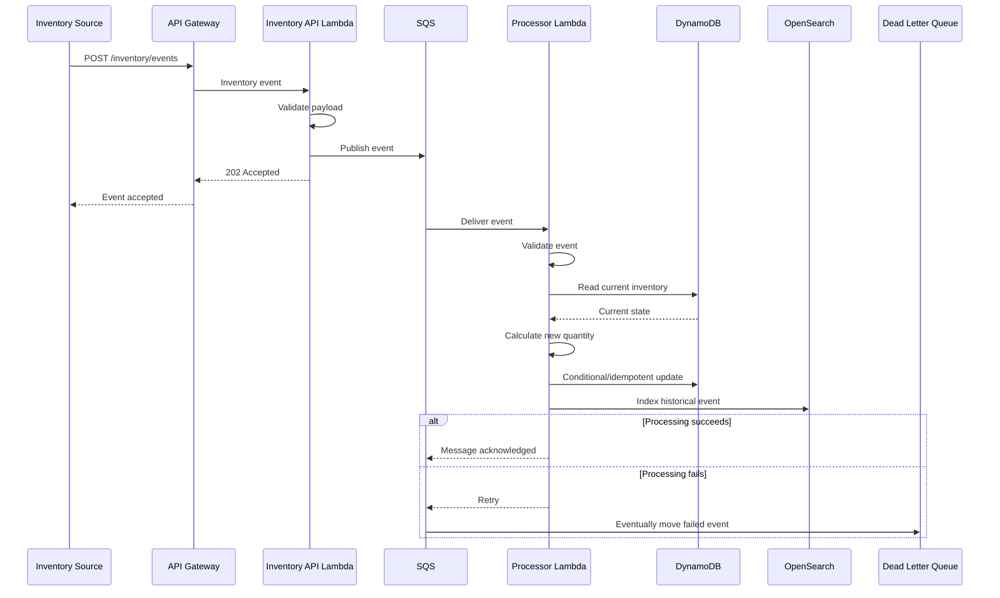

---

# 7. Why SQS Exists

Inventory telemetry can arrive in bursts.

Without a queue:

```text
Inventory Events
      ↓
Lambda
      ↓
DynamoDB/OpenSearch
```

A spike can directly increase processing pressure.

With SQS:

```text
Inventory Events
      ↓
SQS
      ↓
Lambda consumers
      ↓
DynamoDB/OpenSearch
```

SQS provides:

- Buffering
- Retry behavior
- Decoupling
- Failure isolation
- Spike handling
- Dead-letter processing

The API does not need to wait for the entire inventory-processing workflow.

---

# 8. Current Inventory State Flow

DynamoDB is the source of truth for current inventory state.

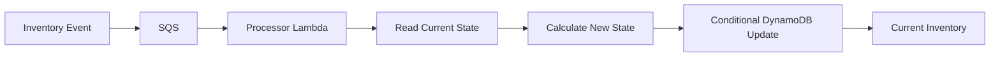

For example:

```text
Current stock = 100
SALE = -20

New stock = 80
```

The processor updates the current state while the original event is independently retained in OpenSearch.

---

# 9. Historical Event Flow

OpenSearch is responsible for historical inventory-event search.

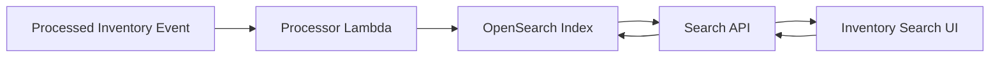

Example searchable events:

- SALE
- RESTOCK
- RETURN
- TRANSFER_IN
- TRANSFER_OUT
- ADJUSTMENT

---

# 10. Smart Reorder Architecture

The Smart Reorder Engine is pure TypeScript business logic and remains independent from AWS.

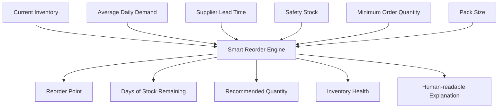

---

# 11. Reorder Calculation

## Available Stock

```text
availableStock =
currentStock - reservedStock
```

## Lead-Time Demand

```text
leadTimeDemand =
averageDailyDemand × supplierLeadTimeDays
```

## Reorder Point

```text
reorderPoint =
leadTimeDemand + safetyStock
```

## Days of Stock Remaining

```text
daysOfStockRemaining =
availableStock / averageDailyDemand
```

## Target Stock

```text
targetStock =
leadTimeDemand + safetyStock + forecastBuffer
```

## Recommended Quantity

```text
rawRecommendedQuantity =
targetStock - availableStock
```

If the result is negative:

```text
recommendedQuantity = 0
```

The result is then adjusted for:

- Supplier minimum order quantity
- Supplier pack size

---

# 12. Inventory Health Classification

The initial engine will classify inventory as:

```text
CRITICAL
REORDER_SOON
HEALTHY
OVERSTOCKED
```

Conceptually:

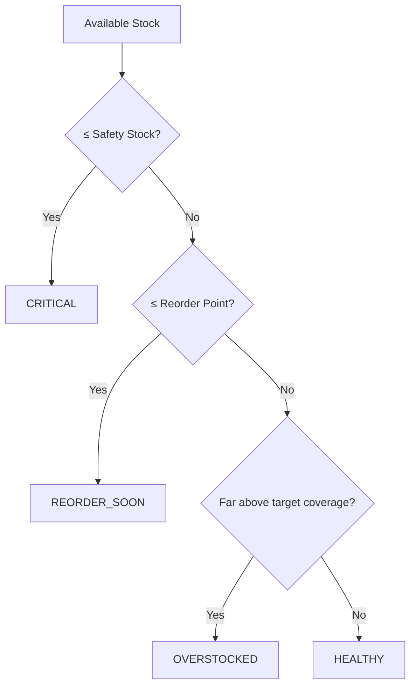

Thresholds should remain configurable rather than being scattered throughout the codebase.

---

# 13. Explainable Recommendations

Every recommendation must contain a machine-readable result and a human-readable explanation.

Example:

```text
Current stock: 12
Average daily demand: 8
Supplier lead time: 5 days
Safety stock: 10
Reorder point: 50

Recommendation: 60 units

Reason:
"Current stock covers approximately 1.5 days of demand,
while supplier lead time is 5 days. Inventory is below
the reorder point."
```

The goal is that a store owner can understand the recommendation without knowing the underlying formula.

---

# 14. Backend Directory Structure

The backend is planned as:

```text
backend/
├── src/
│   ├── config/
│   │   └── env.ts
│   │
│   ├── types/
│   │   ├── product.ts
│   │   ├── inventory.ts
│   │   ├── supplier.ts
│   │   ├── event.ts
│   │   └── reorder.ts
│   │
│   ├── domain/
│   │   └── reorder/
│   │       ├── reorder-engine.ts
│   │       ├── reorder-types.ts
│   │       └── reorder-engine.test.ts
│   │
│   ├── repositories/
│   │   ├── inventory-repository.ts
│   │   └── event-repository.ts
│   │
│   ├── services/
│   │   ├── inventory-service.ts
│   │   ├── search-service.ts
│   │   └── reorder-service.ts
│   │
│   ├── validation/
│   │   ├── inventory-event-schema.ts
│   │   └── inventory-schema.ts
│   │
│   ├── handlers/
│   │   ├── inventory-api.ts
│   │   ├── inventory-event-api.ts
│   │   └── search-api.ts
│   │
│   └── utils/
│       ├── errors.ts
│       ├── logger.ts
│       └── response.ts
│
├── tests/
├── package.json
├── tsconfig.json
└── README.md
```

Lambda entry points:

```text
lambdas/
├── inventory-api/
│   └── handler.ts
├── inventory-event-processor/
│   └── handler.ts
├── reorder-engine/
│   └── handler.ts
└── search-api/
    └── handler.ts
```

Infrastructure:

```text
infrastructure/
├── bin/
├── lib/
├── test/
├── cdk.json
├── package.json
└── tsconfig.json
```

---

# 15. Domain Models

## Product

```text
productId
sku
name
category
supplierId
supplierName
unitCost
sellingPrice
reorderPoint
safetyStock
minimumOrderQuantity
packSize
```

## Supplier

```text
supplierId
name
leadTimeDays
reliabilityScore
```

## Inventory Location

```text
locationId
locationName
region
address
```

## Inventory State

```text
productId
sku
locationId
quantity
reservedQuantity
availableQuantity
reorderPoint
safetyStock
lastUpdated
```

## Inventory Event

```text
eventId
productId
sku
locationId
eventType
quantityChange
previousQuantity
newQuantity
timestamp
source
```

## Reorder Recommendation

```text
productId
sku
locationId
currentStock
reservedStock
availableStock
averageDailyDemand
leadTimeDays
safetyStock
reorderPoint
daysOfStockRemaining
recommendedQuantity
urgency
reason
```

---

# 16. DynamoDB Design

Table:

```text
StockPulseInventory
```

Primary keys:

```text
PK
SK
```

Initial access pattern:

```text
PK = LOCATION#<locationId>
SK = PRODUCT#<productId>
```

Example:

```text
PK = LOCATION#BLR01
SK = PRODUCT#SKU001
```

Stored information includes:

```text
productId
sku
locationId
quantity
reservedQuantity
availableQuantity
reorderPoint
safetyStock
lastUpdated
```

The application should use Query operations rather than scanning the entire table for normal requests.

---

# 17. SQS Design

Queues:

```text
StockPulseInventoryEvents
StockPulseInventoryEventsDLQ
```

The primary queue handles normal inventory events.

The DLQ stores events that repeatedly fail processing.

Expected behavior:

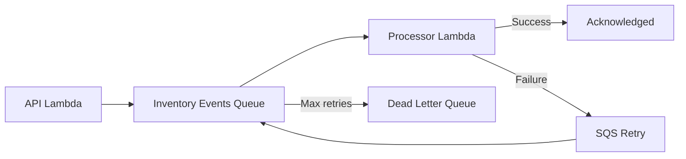

---

# 18. Idempotency

Inventory events must be idempotent.

The same event may be delivered more than once.

Example:

```text
Initial inventory = 100

SALE event = -20
```

First delivery:

```text
100 → 80
```

Duplicate delivery must **not** produce:

```text
80 → 60
```

Instead:

```text
100 → 80
duplicate ignored
```

The implementation will use a DynamoDB-based conditional/processed-event mechanism.

---

# 19. Backend API Contract

## POST /inventory/events

Accept an inventory event.

Example:

```json
{
  "eventId": "evt_001",
  "productId": "prod_001",
  "sku": "SKU-001",
  "locationId": "BLR-01",
  "eventType": "SALE",
  "quantityChange": -3,
  "timestamp": "2026-09-19T10:00:00.000Z",
  "source": "demo"
}
```

Expected response:

```json
{
  "success": true,
  "eventId": "evt_001",
  "message": "Inventory event accepted for processing."
}
```

Expected HTTP status:

```text
202 Accepted
```

---

## GET /inventory

Optional parameters:

```text
locationId
status
page
limit
```

---

## GET /inventory/{productId}

Returns inventory state for a product.

Optional:

```text
locationId
```

---

## GET /inventory/location/{locationId}

Returns inventory for a specific location.

---

## GET /inventory/health

Returns aggregate health:

```json
{
  "totalSkus": 1000,
  "healthy": 700,
  "reorderSoon": 200,
  "critical": 70,
  "overstocked": 30
}
```

---

## GET /inventory/search

Parameters:

```text
q
sku
productId
locationId
eventType
startDate
endDate
page
limit
```

Search is backed by OpenSearch.

---

## GET /reorders

Parameters:

```text
locationId
urgency
limit
page
```

Returns:

- recommendations
- urgency
- recommended quantities
- demand
- lead time
- reorder point
- human-readable reasons
- summary metrics

---

# 20. API Response Convention

Success:

```json
{
  "success": true,
  "data": {}
}
```

Error:

```json
{
  "success": false,
  "error": {
    "code": "INVALID_REQUEST",
    "message": "Invalid inventory event."
  }
}
```

This consistency makes frontend integration significantly easier.

---

# 21. Validation Strategy

Use **Zod** at API boundaries.

Validation must reject:

- Missing identifiers
- Invalid event types
- Invalid numeric values
- Malformed timestamps
- Empty strings
- Invalid pagination values
- Excessively large query limits

Business logic should not rely solely on TypeScript interfaces because TypeScript types disappear at runtime.

---

# 22. Backend Implementation Phases

## Phase B1 — Backend Foundation

### Work

- Node.js setup
- TypeScript
- strict mode
- ESLint
- Vitest
- Zod
- configuration
- structured logging
- response helpers
- error handling

### Outcome

A clean backend foundation that builds and tests successfully.

---

## Phase B2 — Domain Models

### Work

- Product
- Supplier
- Location
- Inventory
- Event
- Reorder types
- Zod validation
- unit tests

### Outcome

Stable domain contracts.

---

## Phase B3 — DynamoDB Repository

### Work

- Inventory repository interface
- DynamoDB implementation
- Mock repository
- Query access patterns
- Unit tests

### Outcome

Current inventory can be persisted and retrieved.

---

## Phase B4 — Event Ingestion

### Work

```text
POST /inventory/events
→ validation
→ SQS
```

### Outcome

The API can safely accept inventory events asynchronously.

---

## Phase B5 — Event Processor

### Work

```text
SQS
→ Lambda
→ DynamoDB
→ OpenSearch
```

### Outcome

Inventory events actually change inventory state and are retained historically.

---

## Phase B6 — OpenSearch

### Work

- OpenSearch client
- event indexing
- search repository
- filters
- pagination
- tests

### Outcome

Fast historical inventory search.

---

## Phase B7 — Inventory API

### Work

Expose inventory endpoints.

### Outcome

The frontend has stable APIs for current inventory.

---

## Phase B8 — Search API

### Work

Expose OpenSearch-backed search.

### Outcome

Users can search historical inventory activity.

---

## Phase B9 — Smart Reorder Engine

### Work

Implement pure business logic.

### Outcome

Inventory health and reorder recommendations.

---

## Phase B10 — Reorder API

### Work

Expose recommendations.

### Outcome

Frontend can display actionable reorder decisions.

---

## Phase B11 — Integration Testing

### Work

Test complete flows.

### Outcome

Confidence that the backend works as one system.

---

## Phase B12 — AWS CDK

### Work

Provision:

- DynamoDB
- SQS
- DLQ
- Lambda
- API Gateway
- OpenSearch
- IAM
- CloudWatch

### Outcome

Infrastructure is reproducible as code.

---

# 23. Infrastructure Architecture

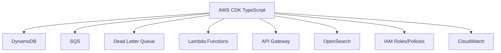

Infrastructure should be deployed using:

```bash
cdk synth
cdk diff
cdk deploy
```

The deployment process should never blindly deploy unexpected infrastructure.

---

# 24. IAM Strategy

Use least privilege.

### Inventory API Lambda

Needs:

- SQS SendMessage
- CloudWatch Logs

### Processor Lambda

Needs:

- DynamoDB read/write
- OpenSearch write
- CloudWatch Logs

### Search Lambda

Needs:

- OpenSearch read
- DynamoDB read where required
- CloudWatch Logs

### Reorder Lambda

Needs:

- DynamoDB read
- CloudWatch Logs

Avoid:

```text
AdministratorAccess
```

for application Lambda roles.

---

# 25. Environment Configuration

Use environment variables such as:

```text
AWS_REGION=ap-south-1
INVENTORY_TABLE_NAME=
INVENTORY_EVENTS_QUEUE_URL=
OPENSEARCH_ENDPOINT=
OPENSEARCH_INDEX=
```

Never commit:

```text
AWS_ACCESS_KEY_ID
AWS_SECRET_ACCESS_KEY
private keys
tokens
passwords
```

Local development should use the AWS credential provider chain / AWS CLI credentials.

Lambda should use IAM roles.

---

# 26. Frontend Architecture

Frontend implementation begins only after backend APIs stabilize.

Technology:

- React
- Vite
- TypeScript
- Tailwind CSS
- Recharts
- Lucide icons

Planned structure:

```text
frontend/
├── src/
│   ├── components/
│   ├── pages/
│   ├── charts/
│   ├── api/
│   ├── hooks/
│   ├── types/
│   ├── utils/
│   └── App.tsx
├── public/
├── package.json
├── tsconfig.json
└── vite.config.ts
```

---

# 27. Frontend Screens

## Dashboard

Display:

- Total SKUs
- Total units
- Inventory value
- Critical SKU count
- Inventory health
- Stock trend
- Low-stock products
- Location overview
- Recent activity

## Inventory

Features:

- Search
- Filters
- Pagination
- Inventory status
- Product details
- Location filtering

## Smart Reorders

Display:

- Critical items
- Reorder-soon items
- Recommended quantity
- Supplier lead time
- Demand
- Reorder point
- Explanation

## Activity

Display:

- Sales
- Restocks
- Adjustments
- Transfers
- Returns

---

# 28. Frontend Data Flow

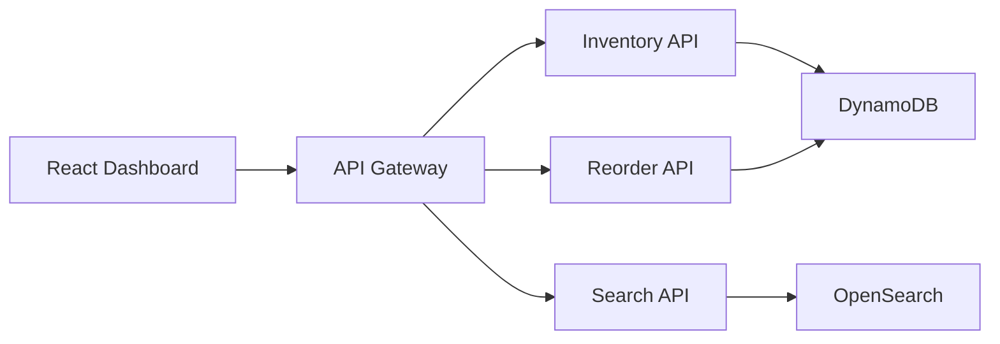

The frontend should not communicate directly with DynamoDB or OpenSearch.

---

# 29. Demo Data Strategy

A deterministic demo-data generator will create:

- 1000 products
- 20 locations
- 50 suppliers
- 90 days of historical inventory events

Example locations:

- Bengaluru
- Mumbai
- Delhi
- Hyderabad
- Chennai
- Pune
- Kolkata
- Ahmedabad

The data should deliberately include:

- Critical stock
- Reorder-soon stock
- Healthy stock
- Overstock
- Demand spikes
- Fast-moving SKUs
- Slow-moving SKUs
- Supplier delays

The dataset should use a deterministic seed so the same dataset can be regenerated.

---

# 30. Testing Strategy

## Unit Tests

Test:

- Validation
- Inventory calculations
- Reorder formulas
- Classification
- Pagination
- Error handling
- Idempotency

## Integration Tests

Test:

```text
POST event
→ queue
→ processor
→ state update
→ event indexing
```

## API Tests

Test:

- HTTP status codes
- request validation
- response formats
- error responses

## Frontend Tests

Later test:

- loading states
- error states
- search
- filtering
- reorder rendering
- product details

---

# 31. Critical Test Scenarios

## Scenario 1 — Sale

```text
Initial = 100
Sale = -20
Expected = 80
```

## Scenario 2 — Duplicate Sale

```text
Initial = 100
Sale = -20
Duplicate Sale = -20

Expected final = 80
```

## Scenario 3 — Restock

```text
Initial = 20
Restock = +100
Expected = 120
```

## Scenario 4 — Critical Inventory

Inventory falls below safety stock.

Expected:

```text
CRITICAL
```

## Scenario 5 — Reorder

Inventory falls below reorder point.

Expected:

```text
REORDER_SOON
recommendedQuantity > 0
```

## Scenario 6 — Historical Search

Search by SKU.

Expected:

```text
Matching historical events
```

## Scenario 7 — Invalid Event

Malformed event.

Expected:

```text
400
```

## Scenario 8 — Processing Failure

Processor failure.

Expected:

```text
SQS retry
→ eventual DLQ
```

---

# 32. Security Plan

Initial MVP:

- IAM least privilege
- No credentials in source
- HTTPS through API Gateway/CloudFront
- OpenSearch not unnecessarily public
- Environment-based configuration
- Input validation
- Query limits
- Structured error handling
- No sensitive data in logs

Authentication is intentionally deferred for the initial hackathon MVP.

---

# 33. Cost Awareness

The architecture intentionally uses serverless services where possible.

Primary cost-sensitive component:

**Amazon OpenSearch Service**

The implementation should use the smallest practical configuration for a hackathon.

Before deployment:

```bash
cdk diff
```

should be reviewed.

After the hackathon/demo, unnecessary resources should be destroyed.

Possible cleanup:

```bash
cdk destroy
```

Only destroy the stack when it is confirmed that the environment is no longer required.

---

# 34. Optional ECS/Fargate Extension

ECS/Fargate is **not required for the core MVP**.

If the hackathon requires a container track, add a separate demand-analysis worker:

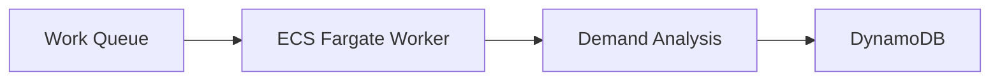

The worker can perform:

- demand aggregation
- demand-spike detection
- heavier calculations
- future forecasting workloads

It should not replace the existing Lambda/SQS architecture.

---

# 35. Deployment Architecture

Final target:

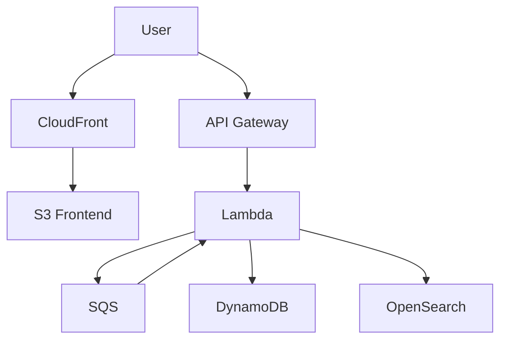

Frontend:

```text
React build
↓
S3
↓
CloudFront
↓
Browser
```

Backend:

```text
API Gateway
↓
Lambda
↓
AWS services
```

---

# 36. Deployment Sequence

The intended sequence is:

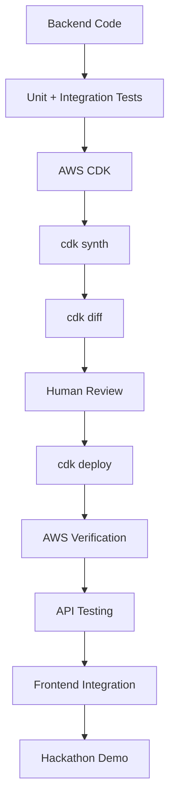

---

# 37. Implementation Status

At the beginning of implementation:

| Area | Status |
|---|---|
| Repository structure | Complete |
| Product concept | Complete |
| AWS architecture | Planned |
| Backend foundation | Next |
| Domain models | Planned |
| DynamoDB repository | Planned |
| SQS ingestion | Planned |
| Lambda processor | Planned |
| OpenSearch integration | Planned |
| Inventory API | Planned |
| Search API | Planned |
| Reorder engine | Planned |
| Reorder API | Planned |
| CDK infrastructure | Planned |
| AWS deployment | Planned |
| Frontend | Planned |
| Demo dataset | Planned |
| Testing | Planned |
| Hackathon polish | Planned |

This document should be updated as implementation progresses.

---

# 38. Immediate Next Steps

## Step 1

Implement backend foundation.

```text
backend/
```

Use the B1 implementation prompt.

## Step 2

Implement domain models and validation.

Use B2.

## Step 3

Implement DynamoDB repository.

Use B3.

## Step 4

Implement SQS ingestion.

Use B4.

## Step 5

Implement event processor.

Use B5.

## Step 6

Implement OpenSearch.

Use B6.

## Step 7

Implement inventory APIs.

Use B7.

## Step 8

Implement search.

Use B8.

## Step 9

Implement smart reorder engine.

Use B9.

## Step 10

Expose reorder APIs.

Use B10.

## Step 11

Run integration testing.

Use B11.

## Step 12

Implement AWS CDK.

Use B12.

## Step 13

Review:

```bash
cdk synth
cdk diff
```

## Step 14

Deploy AWS infrastructure.

## Step 15

Verify end-to-end event processing.

## Step 16

Begin frontend implementation.

---

# 39. Backend Completion Criteria

Backend is considered complete when all of the following are true:

- [ ] TypeScript builds successfully
- [ ] Lint passes
- [ ] Unit tests pass
- [ ] Integration tests pass
- [ ] Domain models are stable
- [ ] Validation works
- [ ] DynamoDB repository works
- [ ] SQS ingestion works
- [ ] Processor Lambda works
- [ ] Event idempotency works
- [ ] DLQ works
- [ ] OpenSearch indexing works
- [ ] OpenSearch search works
- [ ] Inventory APIs work
- [ ] Reorder engine works
- [ ] Reorder API works
- [ ] CDK synthesizes successfully
- [ ] CDK diff is reviewed
- [ ] AWS deployment succeeds
- [ ] CloudWatch logs are usable
- [ ] No secrets are committed

---

# 40. Frontend Completion Criteria

Frontend is considered complete when:

- [ ] Dashboard loads through CloudFront
- [ ] Inventory data is live
- [ ] Inventory health is live
- [ ] Search uses OpenSearch API
- [ ] Reorder recommendations are live
- [ ] Product detail works
- [ ] Location filtering works
- [ ] Activity feed works
- [ ] Loading states exist
- [ ] Error states exist
- [ ] Empty states exist
- [ ] Responsive layout works
- [ ] Production build succeeds
- [ ] No hardcoded production API URLs

---

# 41. Expected Final Outcome

At completion, StockPulse should demonstrate the following complete business flow:

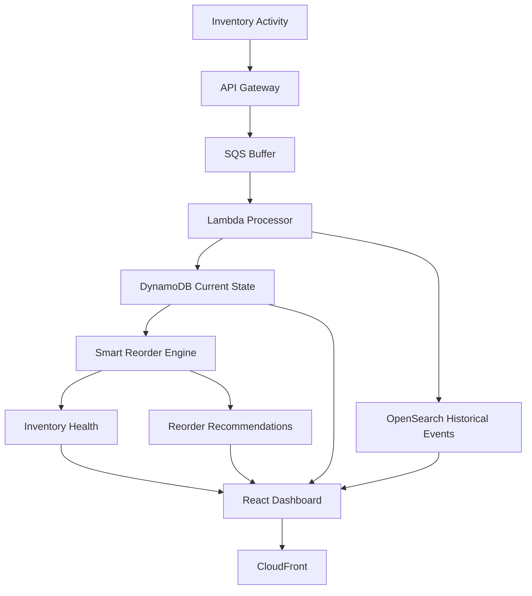

The final user experience should communicate:

> **StockPulse receives inventory activity, processes it asynchronously, maintains a live inventory state, makes historical events searchable, evaluates inventory health, and recommends what to reorder — all through a visual operational dashboard.**

---

# 42. Final Hackathon Demonstration Flow

The recommended demo should tell a story rather than simply showing infrastructure.

## Demo 1 — Current State

Open dashboard.

Show:

```text
Total SKUs
Inventory Value
Critical SKUs
Inventory Health
```

## Demo 2 — Find a SKU

Search:

```text
SKU-1042
```

Show:

- Current stock
- Location
- Supplier
- Lead time
- Historical events

## Demo 3 — Smart Recommendation

Show:

```text
Current stock: 12
Daily demand: 8
Lead time: 5 days

CRITICAL

Recommended reorder: 60 units
```

Then explain the reason.

## Demo 4 — Live Inventory Event

Send:

```json
{
  "eventType": "SALE",
  "sku": "SKU-1042",
  "quantityChange": -10
}
```

Show:

```text
API Gateway
↓
SQS
↓
Lambda
↓
DynamoDB
↓
OpenSearch
```

Then refresh the dashboard.

## Demo 5 — Historical Search

Search the SKU again.

Show its event history.

## Demo 6 — Architecture

Finish by showing the architecture diagram and explaining:

```text
DynamoDB
= current state

SQS + Lambda
= reliable event processing

OpenSearch
= historical search

Smart Reorder Engine
= actionable intelligence

React
= visual no-code experience
```

---

# 43. Definition of Success

StockPulse succeeds as an MVP when a non-technical user can answer these questions from one interface:

1. **What do I have?**
2. **Where do I have it?**
3. **What is running low?**
4. **What changed recently?**
5. **How quickly am I consuming stock?**
6. **How long will my supplier take?**
7. **What should I reorder?**
8. **How much should I reorder?**
9. **Why is StockPulse recommending that quantity?**

The technical implementation succeeds when the system can answer those questions using:

```text
SQS
+
Lambda
+
DynamoDB
+
OpenSearch
+
Smart Reorder Engine
+
API Gateway
+
React
```

without requiring the end user to understand the underlying infrastructure.

---

# 44. Guiding Engineering Principles

Throughout implementation:

1. **Backend before frontend.**
2. **Business logic independent of AWS.**
3. **Current state separate from historical events.**
4. **Asynchronous processing for inventory events.**
5. **Idempotency is mandatory.**
6. **Validate at system boundaries.**
7. **Use least-privilege IAM.**
8. **Never commit secrets.**
9. **Test before deploying.**
10. **Review `cdk diff` before deployment.**
11. **Prefer simple architecture over unnecessary services.**
12. **Every AWS service must have a clear product purpose.**
13. **Recommendations must be explainable.**
14. **Frontend should consume stable APIs rather than directly accessing AWS data stores.**
15. **Build the hackathon MVP first; add advanced forecasting and ECS workloads only when the core system is stable.**

---

# 45. Target End State

```text
                         STOCKPULSE
                             │
              ┌──────────────┴──────────────┐
              │                             │
        CURRENT STATE                 HISTORICAL STATE
              │                             │
          DynamoDB                    OpenSearch
              │                             │
              └──────────────┬──────────────┘
                             │
                     INVENTORY INTELLIGENCE
                             │
                    Smart Reorder Engine
                             │
              ┌──────────────┴──────────────┐
              │                             │
       Inventory Health             Reorder Recommendation
              │                             │
              └──────────────┬──────────────┘
                             │
                      API Gateway
                             │
                      React Dashboard
                             │
                         CloudFront
                             │
                            User
```

**Final outcome:** a working AWS-native inventory intelligence platform that demonstrates real-time event processing, low-latency inventory state, scalable historical search, explainable reorder intelligence, and a polished visual experience.
